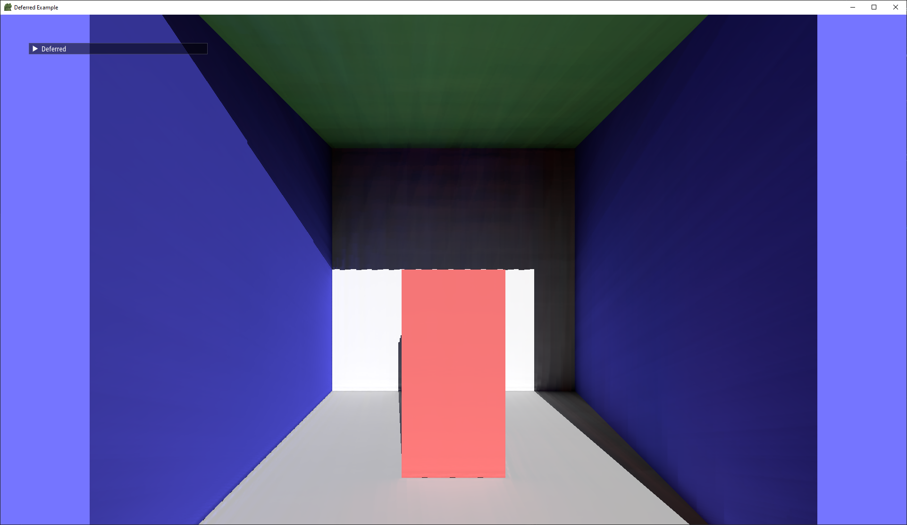
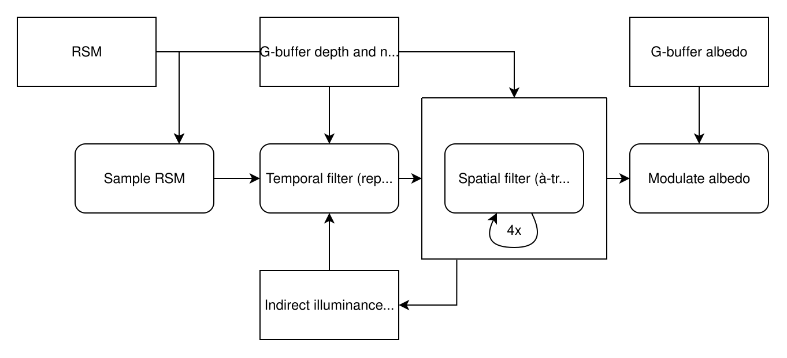

import ReactPlayer from 'react-player'

Reflective shadow maps, introduced in 2005 by Carsten Dachsbacher and Marc Stamminger in [the eponymous paper](https://users.soe.ucsc.edu/~pang/160/s13/proposal/mijallen/proposal/media/p203-dachsbacher.pdf), is a technique for rendering a single bounce of indirect lighting in real time.

RSM is derived from the simple observation that any point that can be directly seen by a light source is itself a light source for first-order indirect illumination. In other words, each texel in a shadow map can be treated as a tiny light that can illuminate the scene. For this purpose, RSMs extend shadow maps to include normals and luminous flux.

While the technique delivers on the promises made in the paper, it suffers from a few drawbacks that make it difficult to use in real applications:

- High runtime cost, even on today's hardware
- Correlations in output
- No indirect occlusion (i.e., light leaking)

In this post, I will describe some techniques to improve the performance and quality of RSMs.

<!-- truncate -->

## Test Program

The CPU code for this blog post can be found in [the Fwog examples](https://github.com/JuanDiegoMontoya/Fwog/blob/main/example/common/RsmTechnique.cpp) (specifically examples 02_deferred and 03_glfw_viewer, for those who want to run the code). The GPU code can be found in [example/shaders/rsm](https://github.com/JuanDiegoMontoya/Fwog/tree/main/example/shaders/rsm).

To generate build files, follow the directions on the main Fwog readme, except replace the final `cmake ..` command with `cmake -DFWOG_BUILD_EXAMPLES=TRUE ..`.

The examples have the same controls and RSM GUI.

- Standard flight control with WASD. Q and E to go down and up.
- Grave accent ` to toggle cursor visibility (for interacting with the GUI).
- Close the program by pressing escape.

## Why?

Implementing reflective shadow maps was my first foray into real-time global illumination. Guided by my previous experiences with monte carlo simulation and denoising, I could be more critical about choices made in the RSM paper as I implemented it. Could the sampling scheme be improved? Can we apply a denoiser to the output?

Despite reflective shadow maps being a dead end as far as global illumination algorithms go, I was tempted to pick the low-hanging fruit that I could see.

## Reflective Shadow Maps Background

RSM is probably the easiest indirect lighting technique to implement with pure rasterization. The algorithm consists of two parts: rendering a reflective shadow map, then sampling random points on it to determine indirect lighting.

The first part is a simple addition to the fragment shader used to render the shadow map:

```glsl
layout(location = 0) out vec3 o_flux;
layout(location = 1) out vec3 o_normal;

// Other shader inputs are intentionally omitted.

void main()
{
  o_normal = normalize(v_normal);
  o_flux = surfaceAlbedo * shadingUniforms.sunStrength.rgb;
}
```

The second part is a loop in a full screen pass in which we compute the indirect illuminance:

```glsl
vec3 ComputePixelLight(vec3 surfaceWorldPos, vec3 surfaceNormal, vec3 rsmFlux, vec3 rsmWorldPos, vec3 rsmNormal)
{
  float geometry = max(0.0, dot(rsmNormal, surfaceWorldPos - rsmWorldPos)) *
                   max(0.0, dot(surfaceNormal, rsmWorldPos - surfaceWorldPos));

  // Clamp distance to prevent singularity.
  float d = max(distance(surfaceWorldPos, rsmWorldPos), 0.01);

  return rsmFlux * geometry / (d * d * d * d);
}

vec3 ComputeIndirectIrradiance(vec3 surfaceAlbedo, vec3 surfaceNormal, vec3 surfaceWorldPos)
{
  vec3 sumIlluminance = {0, 0, 0};

  // Compute the position of this surface point projected into the RSM's UV space
  const vec4 rsmClip = rsm.sunViewProj * vec4(surfaceWorldPos, 1.0);
  const vec2 rsmUV = (rsmClip.xy / rsmClip.w) * 0.5 + 0.5;

  for (int i = 0; i < rsm.samples; i++)
  {
    // Make a random polar coordinate (with maximum radius), then convert to cartesian.
    vec2 xi = Hammersley(i, rsm.samples);
    float r = xi.x;
    float theta = xi.y * TWO_PI;
    vec2 pixelLightUV = rsmUV + vec2(r * cos(theta), r * sin(theta)) * rsm.rMax;
    float weight = xi.x; // Compensate for clustering of samples around the origin.

    float rsmDepth = textureLod(s_rsmDepth, pixelLightUV, 0.0).x;
    if (rsmDepth == 1.0) continue;
    vec3 rsmFlux = textureLod(s_rsmFlux, pixelLightUV, 0.0).rgb;
    vec3 rsmNormal = textureLod(s_rsmNormal, pixelLightUV, 0.0).xyz;
    vec3 rsmWorldPos = DepthToWorldSpace(rsmDepth, pixelLightUV, rsm.invSunViewProj);

    sumIlluminance += ComputePixelLight(surfaceWorldPos, surfaceNormal, rsmFlux, rsmWorldPos, rsmNormal) * weight;
  }

  return sumIlluminance * surfaceAlbedo / rsm.samples;
}
```

The RSM paper also includes an adaptive sampling algorithm that can result in substantial reuse of the computed illuminance. I simplified the algorithm, making it a better fit for the GPU but only enabling up to 4x sample reuse. I will omit it here for brevity, but you can read my implementation in [Indirect.comp.glsl](https://github.com/JuanDiegoMontoya/Fwog/blob/main/example/shaders/rsm/Indirect.comp.glsl#L134-L176).



> A simple scene. The areas not directly lit by the sun receive all their illumination from the RSM.

How many samples of the RSM do you think I'm taking in this scene here? If you guessed 400 - the sample count suggested by the paper - you'd be correct. Even with such a high sample count, structured artifacts are visible.

Now, on my beefy modern GPU (RX 7900 XTX) I can crank the sample count to 1000 and almost completely remove the banding artifacts, all while taking less than three milliseconds to run. But here's the thing- if it takes a few milliseconds on my GPU, then it will take many on less powerful ones. Indeed, the frame time with 100-450 samples was anywhere from 26 to 180 milliseconds on the ancient GeForce Quadro FX4000 used by the paper's authors (and that's with interpolation!).

## Fixing radius dependence

The paper makes an interesting assertion:

> Note that we intentionally decided to store radiant flux instead of
> radiosity or radiance. By this, we don’t have to care about the representative
> area of the light, which makes the generation and the
> evaluation simpler.

Storing radiant flux in the RSM indeed means that evaluation is somewhat simpler, as we could then literally treat each texel of the RSM as a point light emitting in all directions.
However, it doesn't mean we can ignore the area of integration entirely $-$ we would like to be able to adjust the sampling radius without changing the brightness of the indirect lighting.

<ReactPlayer width="100%" height="100%" muted controls loop src='/blog/2026/2026-05-04-improved-rsm/rmax_fix_before.webm' />

<br></br>

The fix is straightforward: multiply the computed illuminance by the integration area. The factor is proportional to the product of the UV-space sampling radius and the world-space width of the light frustum. For example, if `rMax` is 0.1 and the RSM is rendered with a square orthographic projection of side length 100, then the factor would be $\pi \cdot (0.1 \cdot 100)^2 \approx 314$ if we were sampling a disk.

Now, the illuminance is independent of the sampling radius.

<ReactPlayer width="100%" height="100%" muted controls loop src='/blog/2026/2026-05-04-improved-rsm/rmax_fix_after.webm' />

<br></br>

The authors of the paper may have included this normalization originally, but since no code was provided it's impossible to tell.

## Stochastic sampling

In the videos above, you may have noticed that it looks like there are tiny copies of the scene pasted all over. This is an artifact caused by all pixels using the same sequence of random numbers. A small shift in the domain leads to a small shift in the output. This is also the cause of the projective aliasing (streaking on the walls).

To fix, we add some per-pixel noise to the per-sample noise. I originally had

```glsl
for (int i = 0; i < rsm.samples; i++)
{
    vec2 xi = Hammersley(i, rsm.samples);
    ... // Sample RSM
}
```

and, with a noise texture (any source of per-pixel noise works), changed it to

```glsl
ivec2 gid = int(gl_GlobalInvocationID.xy);
vec2 noise = rsm.random + textureLod(s_blueNoise, (vec2(gid) + 0.5) / textureSize(s_blueNoise, 0), 0).xy; // Nearest + repeat sampler.
for (int i = 0; i < rsm.samples; i++)
{
    vec2 xi = Hammersley(i, rsm.samples);
    xi = fract(xi + noise); // Cranley-Patterson rotation (or toroidal shift) to keep the noise in [0, 1).
    ... // Sample RSM
}
```

`rsm.random` is additional per-frame noise that will be later required for temporal filtering.

Open the images in a new tab to see them in full resolution.


> Left: 400 SPP with the same sample offsets for each pixel. Right: 4 SPP with sample offsets randomized per pixel. Bottom: 400 SPP with randomized sample offsets.

It's important to note that the additional randomization reduces spatial coherency and thus thrashes the cache more, making individual samples more expensive on average.

## Denoising

While the old artifacts are gone, we introduced a new one: noise. Fortunately for us, denoising is a well-known problem with lots of pertinent literature. Let's build a spatiotemporal denoiser!



> Overview of the denoiser architecture. The first step, stochastically sampling the RSM, is unchanged from before. After that, a temporal filter is applied to the output which reprojects and reuses the illuminance from the previous frame. Then, a spatial (screen-space) filter is applied multiple times to remove remaining noise. The result of the first spatial filter iteration is written to the history buffer, leading to a recurrent blur that smooths the image over time. Finally, the raw illuminance is multiplied by the g-buffer albedo to get the final indirect illuminance.

The denoising architecture was inspired by several sources. It's been several years so I cannot recall exactly what I picked from where, but I do know that these were helpful.

- [Overview of denoising techniques](https://alain.xyz/blog/ray-tracing-denoising)
- [Falcor](https://github.com/nvidiagameworks/falcor) (rendering framework)
- [FidelityFX Denoiser](https://gpuopen.com/fidelityfx-denoiser/) (check the docs)
  - [Presentation on YouTube](https://youtu.be/RTtVC-Zk5yI)
- [D3D12 Raytracing Real-Time Denoised Ambient Occlusion sample](https://github.com/microsoft/directx-graphics-samples/blob/master/Samples/Desktop/D3D12Raytracing/src/D3D12RaytracingRealTimeDenoisedAmbientOcclusion/readme.md)
- [Spatiotemporal Variance-Guided Filtering](https://cg.ivd.kit.edu/publications/2017/svgf/svgf_preprint.pdf) (paper)
- [Fast Denoising with Self-Stabilizing Recurrent Blurs](https://developer.download.nvidia.com/video/gputechconf/gtc/2020/presentations/s22699-fast-denoising-with-self-stabilizing-recurrent-blurs.pdf)
  - [Presentation at developer.nvidia.com](https://developer.nvidia.com/gtc/2020/video/s22699-vid) (requires login)

### Spatial Filter

Though not the first step of the denoiser we're building, it is the easiest to implement in isolation. The spatial ([bilateral](https://en.wikipedia.org/wiki/Bilateral_filter)) filter is based on the technique described in [Edge-Avoiding À-Trous Wavelet Transform for fast Global
Illumination Filtering](https://jo.dreggn.org/home/2010_atrous.pdf).

The technique is essentially a screen-space blur with some key components:

- À-trous means "with holes", in this context referring to the blur kernel. Normally when performing blurs, we use a dense kernel. For example, a 5x5 kernel would sample every texel in a 5x5 region. With our holey kernel, we take the same kernel but add empty rows and columns so our actual samples are spread apart.
  - The kernel is invoked multiple times, doubling the spacing between samples each time. This greatly increases the apparent kernel size for the result without requiring a huge number of samples. The authors of the À-Trous paper note that five iterations of their 5x5 kernel is equivalent to an 80x80 kernel. 125 samples instead of 6400.
- Edge-avoiding weight functions are used to prevent blurring over spatial discontinuities. The basic form of these functions is `exp(-diff / phi)`, where `diff` is a measure of "how different" the thing being measured (in this case, view-space depth or normals) is between the center texel and the sample. `phi` is a uniform that influences the "strength" of the weight, with smaller values magnifying differences. Finding good values of `phi` for the different weight functions takes some trial and error, making them good candidates to put in a debug UI.

The paper has a helpful implementation of the shader at the end. My implementation can be found in [shaders/rsm/Bilateral.h.glsl](https://github.com/JuanDiegoMontoya/Fwog/blob/main/example/shaders/rsm/Bilateral.h.glsl).


> Left: 1 SPP without spatial filtering. Right: 1 SPP with four passes of a 5x5 kernel (à-trous).

### Temporal Filter

While the spatial filter looks impressive in static images, it's quite splotchy and unstable in motion.

<ReactPlayer muted controls loop src='/blog/2026/2026-05-04-improved-rsm/unstable1.webm' />

> Temporal instability with 1 SPP and a sptial filter.

The remedy is to have more samples in the input. The cheapest place to find these samples is in the output of the previous frame, assuming the scene and lighting haven't changed significantly since then.

The temporal filter, which is actually the first pass after computing the raw illuminance, attempts to reuse indirect illumination from previous frames. The compute shader performs the following steps:

1. Reprojects the current texture coordinate into the previous frame's basis.
2. Inspects the nearest 2x2 texels (bilinear footprint) for "consistent" samples. A consistent sample is one whose depth and normal are similar enough to the current one's to be reused. I reuse the edge-stopping weights from the spatial filter for this, except with a hard cut-off if the weight is too low.
   1. If there is at least one consistent sample, bilinearly interpolate the samples (invalid samples are black). Also bilinearly interpolate the "validity" of the sampels and use the result as a divisor to fix the result.
   2. If there were insufficient consistent samples, perform a wider range (e.g. 3x3 or 5x5) search and accumulate them directly with the edge-stopping weights.
      1. If the accumulated weight is below a threshold, consider it to be a disocclusion. Only the current frame's illumination will be used and the history length for the texel will be reset.

If there was not a disocclusion, the following function is called to determine the updated illuminance:

```glsl
void Accumulate(vec3 prevColor, vec3 curColor, ivec2 gid)
{
  uint historyLength     = min(1 + imageLoad(i_historyLength, gid).x, 255);
  float alphaIlluminance = max(uniforms.alphaIlluminance, 1.0 / historyLength);
  vec3 outColor          = mix(prevColor, curColor, alphaIlluminance);

  imageStore(i_historyLength, gid, uvec4(historyLength));
  imageStore(i_outIndirect, gid, vec4(outColor, 0.0));
}
```

The formula used to calculate `alphaIlluminance` was chosen to hasten convergence in freshly-disoccluded areas (using a linear moving average), while eventually falling to the minimum alpha (exponential weighed moving average) which is chosen to balance responsiveness and quality.
The SVGF paper uses an alpha of 0.2, but I found it to lead to poor temporal stability with low sample counts, so I used 0.05 instead.

The full temporal filter shader can be found at [Reproject.comp.glsl](https://github.com/JuanDiegoMontoya/Fwog/blob/main/example/shaders/rsm/Reproject.comp.glsl).

### Recurrent Blurring

A relatively important note- the history buffer comprises the output from the temporal filter *and* the first iteration of the spatial filter (refer to the architecture diagram). As the name implies, this will repeatedly blur the illuminance over time, effectively distributing some of the spatial filtering into the time domain and reducing the amount of spatial filter passes required.

## Bonus Perf

I found a few more tricks that provided sizable performance improvements while altering the image very little.

### Separable Bilateral Filter

A ubiquitous optimization when implementing gaussian kernels is to [separate them](https://bartwronski.com/2020/02/03/separate-your-filters-svd-and-low-rank-approximation-of-image-filters/) into two 1D passes, reducing the cost from $N^2$ to $2N$. For gaussians, it can be shown that the application of the two 1D kernels are equivalent to that of the original 2D kernel, but the same cannot be said for bilateral filters.

What if we ignore the fact that separating the bilateral filter produces a non-equivalent result?


> Left: Demodulated 8 SPP output from 2D bilateral filter. Right: demodulated 8 SPP output from two 1D bilateral filters. Viewed is an area of the scene containing lots of spatial discontinuities, which is where differences between the filters are most likely to appear.

Without flipping between the images, and especially when albedo is factored in, the difference in quality is practically negligible. This provides about a 62% speedup for a 5x5 kernel (1.13ms to 0.43ms at 1080p on my RX 7900 XTX), which is almost perfectly consistent with the 60% reduction of samples.

### Minifying the shadow map

Recall that removing the correlation in sample positions between pixels reduced performance of the RSM sampling pass. This indicates that the pass' performance is at least partly limited by cache misses, which can be improved by reducing the scope of the memory we're trying to access.
In other words, minifying the RSM can make it cheaper to sample. In fact, reducing the size of the RSM by half on each axis (quarter area scale) provided approximately a 45% uplift in sampling throughput (from 15.5ms to 8.5ms in an artificial test with inflated sample counts).

Of course, this optimization is only applicable for RSM buffers that have a relatively low rate of change. This is broadly true for the flux-albedo buffer in most scenes, and for the depth and normal buffers in scenes that don't contain lots of small holes.

## Conclusion

Old dogs *can* learn new tricks, as long as the dog's name is Reflective Shadow Maps and the trick is spatiotemporal filtering.

Adding per-pixel pRNG to the sampling fixed the correlation and projective aliasing issues from the original paper, but introduced noise. The addition of a two-phase denoiser that comprises a temporal filter followed by repeated spatial filtering cleans up the noise and allows us to greatly reduce the sample count from 400 (which exhibited strong artifacts) to 8 or fewer (which exhibits nearly imperceptible artifacts). The separable bilateral filter and RSM minification tricks further reduced the performance cost of the algorithm.


> 8 SPP in Sponza (left) and Lumberyard Bistro (right). The entire indirect lighting pass in each takes less than 1ms at 1080p.

Altogether, the result is clean single-bounce indirect lighting with an extremely low runtime cost. However, the questions of light leakage and indirect bounces beyond the first remain unanswered.