After I found out about a fairly old NVIDIA library which aimed to simulate fluids in real-time using particles, I wanted to see if I could get it working in a fairly old game. Garry's Mod, which might be familiar to some of you, is a sandbox game from 2004 which uses the Source Engine and most importantly, the archaic Direct3D 9 API. I'm hoping this article will provide some insight into how to render fluid in real-time and the technical challenges that come with trying to do so in a game that was never designed to support it.

<!-- truncate -->

The library I found is called [NVIDIA FleX](https://developer.nvidia.com/flex), and it seems like the intended goal was to allow game developers to use the GPU-agnostic and engine-agnostic library to seamlessly integrate fast and cheap fluid simulations into their games. However, it never really caught on and the only notable use of it was in the game Killing Floor 2, which used it for realistic blood spray and gory bits.

The next sections will cover the major technical challenges that I faced and finally the actual fluid rendering techniques I used for the final product which I named Gelly.

## D3D9 and D3D11 Interop Nightmare

Direct3D 9 being as old as it is means a major technical hurdle in this project was that it doesn't support FleX natively and certainly would not support any modern fluid rendering techniques. After much brainstorming, I eventually found out from the MSDN that there exists an ability for D3D9 and D3D11 to interoperate with each other by **sharing** textures.

This was a big breakthrough and meant I could force a separate renderer that does not interfere with the game's renderer as it would run on D3D11, and the only thing I would have to do is share the final rendered texture back to D3D9 and draw it as a fullscreen quad. However... I realized quickly that this is far easier said than done. D3D9 and D3D11 have very different ways of handling resources, and getting them to talk to each other is a nightmare.

This [article](https://learn.microsoft.com/en-us/windows/win32/direct3darticles/surface-sharing-between-windows-graphics-apis) by Microsoft had a passing mention about D3D9Ex and D3D11 interoperability, which was a newer version of D3D9 that added some features to allow it to work better with D3D11. Thankfully, Garry's Mod uses D3D9Ex, so I was in luck. The main issue now was figuring out how to actually create a shared texture and get it to work with both APIs.

The actual flow ended up being something like this:
1. D3D9 renderer creates all of the necessary shared GBuffer resources, which is passed to the D3D11 renderer as shared handles.
2. D3D11 renderer receives it all as `ID3D11Texture2D` via `ID3D11Device::OpenSharedResource` and creates the necessary views for rendering.
3. On each game frame, the D3D9 renderer signals to the D3D11 renderer that it can start rendering by setting a shared fence value, and the D3D11 renderer waits for this signal before it starts rendering.
4. D3D11 renderer does all of the fluid rendering and then signals back to the D3D9 renderer that it's done by setting another shared fence value, and the D3D9 renderer waits for this signal before it tries to use the rendered texture.

The last step was a major issue, the thing about D3D9 and D3D11 interop is that there really is not a way for the software side of things to know about each other. Microsoft warns of this, so it is up to you to ensure **all** resources are not being used by either or when any side is rendering or otherwise consuming the shared resources.

The next major issues were **formats**, which was equally awful. Microsoft has no official documentation for what really works and what doesn't, so there was a lot of trial and error involved in how to share things like depth buffers. As many people do, depth is *typically* written as a 24-bit value, but of course - D3D9 has zero support to share such a format. Eventually, I had to bite the bullet and share an absolute gargantuan of a texture for the crucial features, which was a full-screen 32-bit float texture for depth. This is the only format that works for sharing depth between D3D9 and D3D11, but I ended up using a lot of the bits for other things to at least make it somewhat worth it.

Finally, the last major issue was synchronization. This was *conceptually* simple, as I would just have D3D11 run, then D3D9 run, but in practice this lead to pretty poor performance. *Some* kind of parallel work was necessary, and eventually I made it so that while the actual game logic would run, the D3D11 renderer would kick off FleX's simulation using an asynchronous D3D11 compute queue (which, yes is akin to Vulkan's queue model, available only in the later versions of D3D11). Once the game logic is done and it needs to render, D3D11 is then signaled to wait for the simulation to finish. After which, everything is now serialized and the D3D11 renderer can safely render and complete its work before D3D9 tries to use the rendered texture.

Getting that right was a challenge in and of itself because D3D11's runtime likes to re-arrange things for optimal performance, and in normal situations that is fine - but in ours it led to a lot of square flickering and other weird artifacts. It took a lot of fiddling with D3D11 device flags and other settings to get it to a point where it would actually work without any artifacting.

## Simulation

I think it will be worth it to cover some of the details of how simulation was implemented. As mentioned before, I did not make my own, but rather used NVIDIA's convenient FleX library. It was quite simple but not really straightforward as I assume it is more or less in a gray area as it is available for download but hasn't had an update in years.

The main thing to note is that the library operates in a bring-your-own-buffers style. You do create simulation buffers for the library, but those are more or less internal opaque pointers. FleX provides a function to do a strictly GPU-GPU copy of those buffers, which is how I can render the simulation data quickly by copying it into a pre-made **vertex buffer**. There is no conversion step which is what really enabled the performance of the renderer, it's simply just writing raw into this point vertex buffer the renderer uses.

It also allows you to use NVAPI which is NVIDIA's proprietary API for doing specialized optimized operations on NVIDIA hardware. AMD AGS is also supported, and I enable both when applicable. This mainly allows FleX to internally expose wave-level operations to itself, something you might find in modern graphics APIs instead.

Anyway, the main point of all of this is that simulation is tied to rendering via these light copies. FleX simply pipes the simulated data for each frame into the D3D11 renderer. Along with point information, it also provides a very useful WPCA-based anisotropy buffer and velocity buffer, which will be described in detail in the later sections.

## Rendering, Part 1: History

I try not to reinvent the wheel, unless absolutely necessary, so to begin the rendering part of the project I did some research into how other people have done real-time fluid rendering, or if any SIGGRAPH papers have been published on the topic. I found a lot, and they are roughly separated into three categories (ordered from least to most expensive):
1. **Screen-space particle rendering**: This is what I eventually went with, and is the most flexible technique. It involves rendering each point as a centered screen-space quad (much like a billboard), and then using the fragment shader to inscribe a sphere with the appropiate normals and other information. Essentially, you are capturing the shape and other information of the fluid by **splatting** many little spheres into the frame, then smoothing it out later on.
2. **Raymarching**: This is a more expensive and complicated technique, but it can yield results that are purely world-space and look more accurate. Typically you will create some sort of data structure to encompass the fluid, most do a grid-based approach where each voxel encodes some sort of distance field. Then, the fluid is rendered in one screen-space step where each pixel traces into the fluid using raymarching to find the isosurface.
3. **Isosurface extraction**: This is a bit of a catch-all hence the name, but the general idea is you use the fluid simulation to build a world-space data structure like density or distance fields, and then you can run an algorithm like Marching Cubes to extract the isosurface as a mesh of the fluid. This is the most expensive technique, but it can yield the best results as you have a real mesh to work with and can do all sorts of traditional rendering techniques on it. Also, it appears to have more relevance in the VFX industry because it can extract meshes that get exported to other software.

Screen-space particle rendering was popularized by a 2010 GDC presentation by NVIDIA, [Screen Space Fluid Rendering for Games](https://developer.download.nvidia.com/presentations/2010/gdc/Direct3D_Effects.pdf), itself a follow-up to their 2009 ACM I3D paper, [Screen Space Fluid Rendering with Curvature Flow](https://wstahw.win.tue.nl/edu/2IV06/andrei/particle_rendering/provided/p91-van_der_laan.pdf).

This paper proposes the following method for rendering screen-space fluids, and it is quite long but simple:
1. Render each particle in the fluid simulation as a *point sprite*, essentially a screen-space quad that is always facing the camera, centered at the particle's position. The size of the quad is determined by the particle's radius.
2. Apply perspective projection to the quads, which will make them appear as circles in screen space.
3. In the fragment shader, splat the **depth only** of the sphere inscribed in the quad. This is important, as depth is the main feature of the fluid surface that this technique derives the rest from.
4. After rendering the particles, the resulting depth buffer will have many spheres forming the nearest surface of the fluid. However, it will look like a collection of spheres.
5. This particular paper proposes the *Curvature Flow* filter, which is essentially a filter that goes over the depth buffer and smooths it out by minimizing local curvature. This is an iterative process which aims to smooth the surface to approximate the real fluid surface.
6. After the depth buffer is smoothed, a screen-space pass is done to compute the normals of the fluid surface by looking at the depth buffer and computing the gradient. This will give you a normal map of the fluid surface.
7. Next, to capture thickness, a new texture is rendered by again converting all particles to screen-space quads, but this time it splats a simple faded circle that is white in the center and black at the edges. Using additive blending, this will give you a thickness map of the fluid, which can be used for effects like absorption. A brief reminder though, this is completely arbitrary and not based on the true distance from the entrance and exit points of the fluid, but it can be a good enough approximation for many cases.
8. Finally, the fluid is rendered as a fullscreen pass, where the normals and thickness maps are sampled to compute lighting and shading. The depth buffer is also used to properly composite the fluid with the rest of the scene by depth testing

Their results were quite impressive for the time, and it does indeed create a convincing fluid surface:
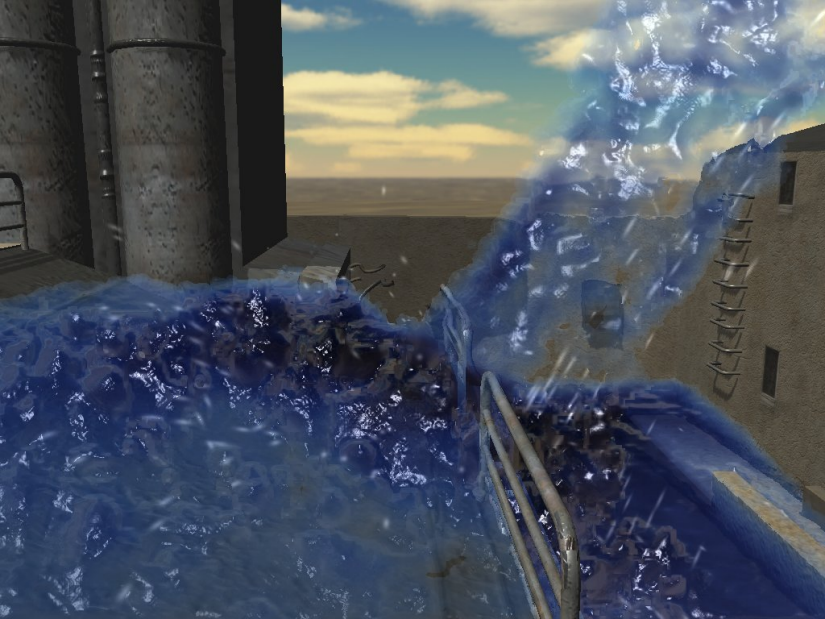

Now that the history and the general method is out of the way, the next section will cover how I implemented my own screen-space particle renderer similar to the one described in the paper, but with *many* improvements and optimizations. However, do note that **shading** is a different task and was done in the D3D9 renderer, where I implemented simple screen-space refraction and cubemap support to give the fluid its final shading.

## Rendering, Part 2: This Looks Terrible

*note: some images/videos were lost and are of lower quality than the original, sorry about that*

After I implemented an incredibly naive version which is almost verbatim to the method described in the paper, I realized that, to put it bluntly, it looked terrible. It just looked like garbage. It was more similar to the look of caviar eggs than water, and generally the fluid surface was not that convincing.

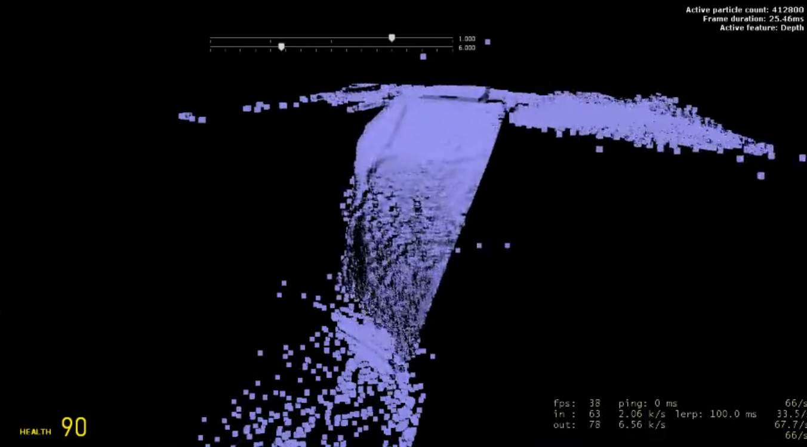

There was definitely mistakes also made, like why are the quad seams still visible, but even after fixing those, the result was still bad. It was fundamental to the filter, which as I mentioned before, is essentially just a blur, and blurring something that looks bad to begin with will still look bad. Fixing the original issues with the filter did improve it, to an extent:

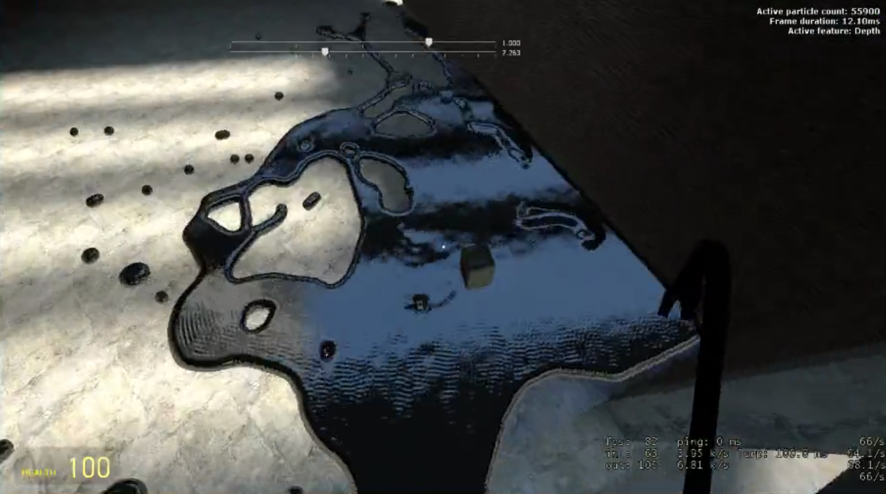

This actually looked like fluid, at least. It was rough, but you could see the general shape and it was somewhat convincing. However, if you zoom in, you can *still* see the individual spheres, and it has a very grainy and rough look to it. It was still a good starting point to work on though.

I realized that continuing to use GMod is probably going to be a drag, so I decided to build a smaller application aptly named Testbed to work on optimizing the filter. Since Gelly was game-agnostic as well (later on, this became possibly one of the worst technical decisions ever made), it was simple to connect it to this testbed so I could just render particles and work on the filter itself.

I used Nghia Truong's very kindly [open-sourced dataset](https://github.com/ttnghia/RealTimeFluidRendering) of rigorous particle fluid simulations and parsed those datasets in the testbed program so I could simply focus on the rendering and filtering. That project also contains the more modern *Narrow-Range* filter which I later implemented.

The Narrow-Range filter was very important for the next iteration of my fluid renderer, as Truong's results indicated that the filter is the main bottleneck for quality. I was more interested how, when a wave shape is encountered, the filter is smart enough to know that the discontinuity from the crest of the wave to whatever was behind it is not actually a depth discontinuity, but rather a surface discontinuity, and it should not blur across it. This is a common issue with the Curvature Flow filter, as it will blur across these wave crests and make them look very flat and unrealistic.

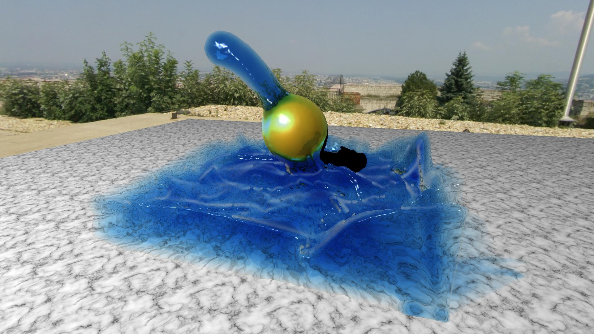

As you can see, the water actually looks like water now, and there is a very smooth surface complete with nice, visible waves. Essentially, the crux of the paper is that previous filters disregard the fact that large depth discontinuities indicate entirely separate surfaces all together:

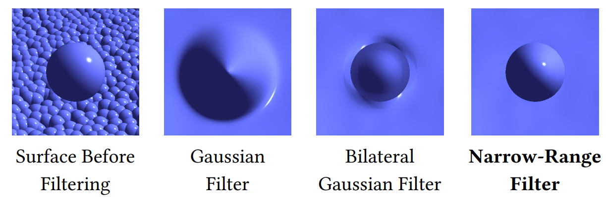

As you can see, from the leftmost picture, this is a single particle above many others. The Gaussian filter fails completely and generates an almost conical normal map, thinking this is a single surface. The bilateral gaussian filter generates incorrect results entirely, but atleast creates some sort of matching change in depth. Finally, the narrow-range filter perfectly preserves the discontinuity, and thus creates a very accurate normal map. This is the main reason why the narrow-range filter looks so much better than the curvature flow filter, and it was a crucial improvement for my renderer.

As the name implies, the filter considers a narrow range of depth values around the current pixel, and only blurs pixels that fall within this range. This allows it to preserve sharp features like wave crests, however it does sometimes lead to a special artifact, where the surface is almost "pinched."

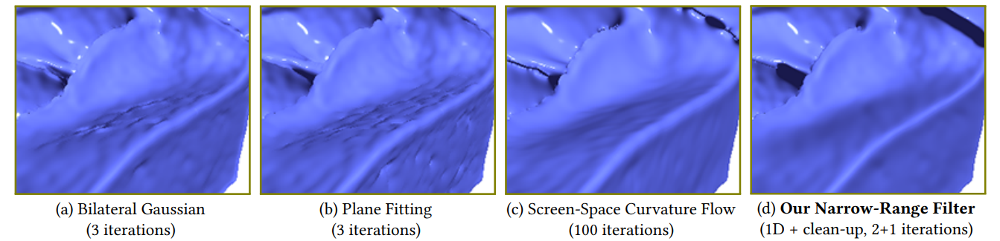

As you can see, all of the other filters are definitely worse, but note how the "lip" of the fluid surface is preserved in each with the same width. On the other hand, the narrow-range filter causes it to shrink in width, and it looks more like a sharp lip than a smooth one. This is a problem, and it gets worse the more there are complex features in the fluid. In my implementation, it became fairly noticeable:

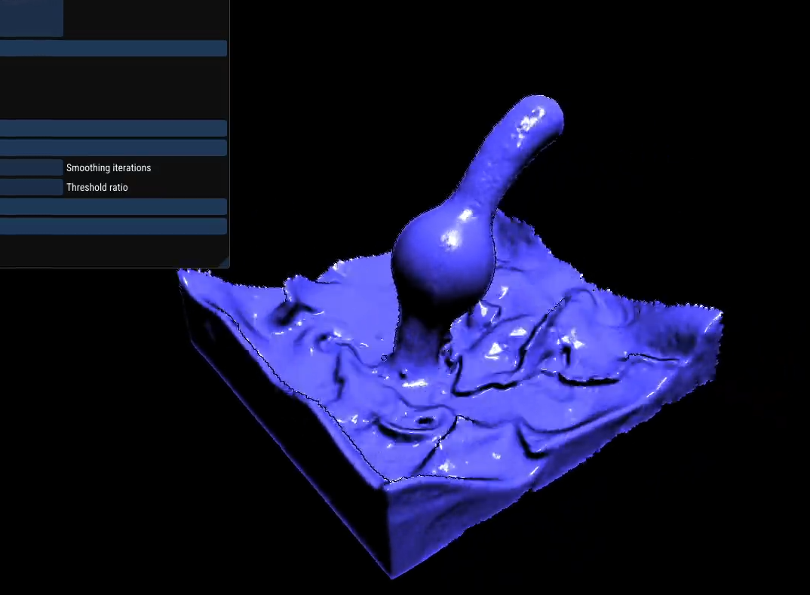

Of course, comparing to what I orignally had, this is a huge improvement, but you can see how every wave or protruding feature just looks abnormally smoothened and pinched. Additionally, it did struggle with minor discontinuities created by particles which are sized down to less than a pixel, which essentially creates noise in the resulting depth buffer.

## Rendering, Part 3: Ellipsoids are in

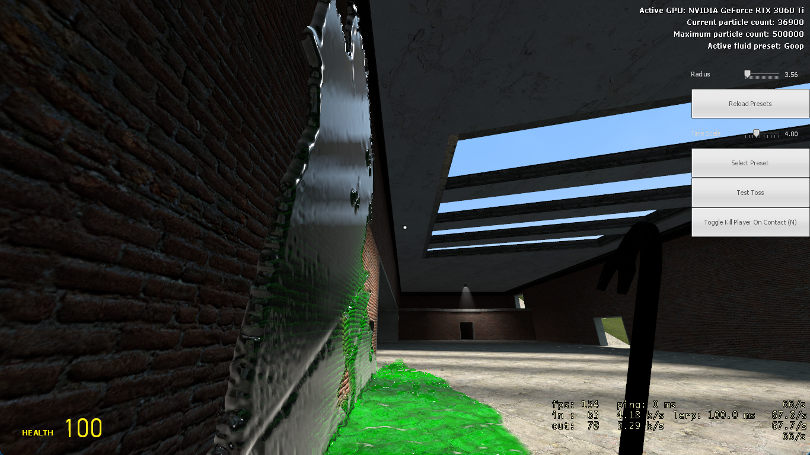

This is a screenshot of the new filter and it being inside GMod and shaded as such. It looked alright at the time, and at least you could actually make out the fluid surface unlike with curvature flow. However, it kept bugging me how the fluid surface just looked so blobby and sometimes not even connected.

The main issue, irrespective of the filter, was that the particles were rendered as spheres, which is a common practice in particle-based fluid rendering. However, it is well known that using spheres can lead to a very blobby and rough look, especially when the particles are not small enough. This is because spheres do not capture the anisotropy of the fluid surface, and they can create a lot of noise in the resulting depth buffer. So, I decided to use the FleX anisotropic WPCA buffer to finally render the particles as ellipsoids instead of spheres, but it took a decent amount of work.

Rendering ellipsoids is much more expensive and complicated than rendering simple spheres, but most of the hard work was actually done by FleX already. So, once again, I searched for prior art relating to ellipsoid splatting and finally found a paper by Yanrui Xu et al. called [Anisotropic screen space rendering for particle-based fluid simulation](https://www.sciencedirect.com/science/article/pii/S0097849322002308). While anisotropic splatting is not a new topic, this paper *was* actually cutting edge at the time, released only a few months after I began working on the project, and it was exactly what I needed to implement ellipsoid splatting with respect to fluid rendering.

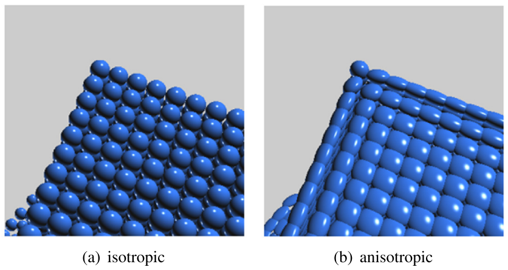

As you can see, the isotropic renderer looks more like beads arranged together, while the anisotropic renderer looks more like a connected fluid surface. The anisotropy allows the renderer to capture the local flow of the fluid, which in turn enables the splatted ellipsoids to accurately represent the surface by stretching and orienting themselves according to the flow. This is especially important for capturing features like waves and splashes, which can be very difficult to capture with simple spheres.

The main idea of the paper is to reframe the original splatting technique as an operation taking place in **parameter space**, where instead of just splatting a sphere, you solve for the intersection of the view ray with the isotropic sphere in parameter space. This parameter space is then anisotropically transformed to world space using the covariance matrix determined earlier from WPCA, which is essentially the final stretching and orientation of the ellipsoid.

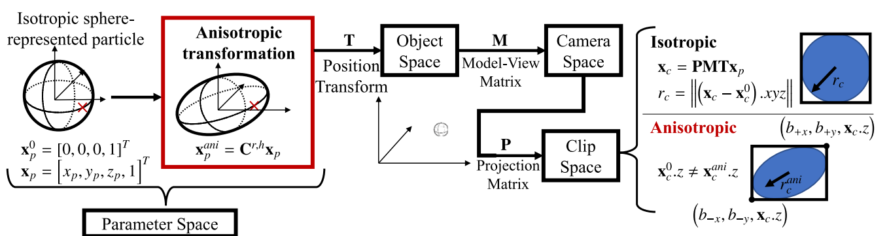

Solving for the intersection in parameter space is quite simple and still enables us to use the isotropic radius from the simulation parameters to accurately capture the size of the particles without messing with anisotropy. The next step was to figure out how to make the original quad billboards big enough for a full ellipsoid to be inscribed in them, which was a bit of a pain but I eventually got it working. That was done by solving for the maximum and minimum extents of the ellipsoid in clip space by using the quadric form of the ellipsoid and solving for the roots of the X-axis and Y-axis. It is done in clip space since this is sent from the vertex shader to the geometry shader, and it is much easier to do the math in clip space as we can just directly output the final vertex positions without having to worry about the view and projection matrices.

And finally...

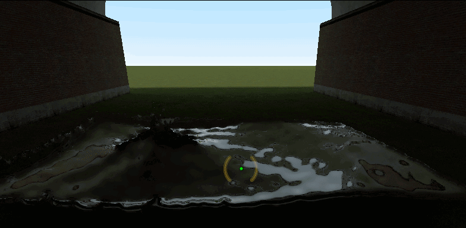

It looked pretty good! There are still a lot of noisy particles, but overall the surface looks much more connected and smooth, and it is much easier to make out the shape of the fluid. The anisotropy really makes a huge difference in the quality of the fluid surface, and it was definitely worth the effort to implement it.

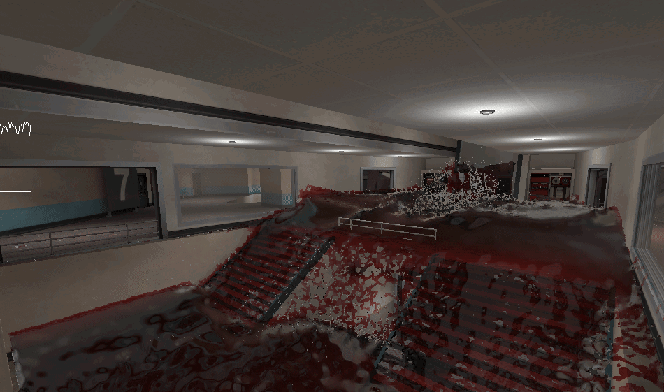

So, while the anisotropy did help with the overall look of the fluid, it did not solve everything, and at least in this screenshot, you can see there's still noise and it looks pretty bad especially in the distance. This is because the anisotropy can sometimes scale particles down below the size of a pixel, which creates a lot of noise in the resulting depth buffer.

After much brainstorming (again), I figured out that the aforementioned covariance matrix can also be used as a way to determine the effective weight of a particle to the overall world-space surface. By taking the max of all of the variance values, we can get a good estimate of how much a particle should contribute to the final surface, and if it is below a certain threshold, we can just discard it entirely. This is a bit of a hack, but it works surprisingly well and it is very cheap to compute as well. It immensely helps with the noise issue, especially in the distance where particles tend to clump together and create a lot of noise. In this screenshot, 2 balls of Gell-O (jelly) collided and the shape and surface is very visible and there is barely any small noisy particles, which is a huge improvement from before.

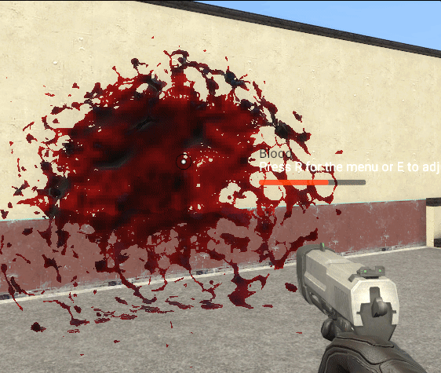

Finally, the best part is that the newly increased ALU pressure from the math-heavy ellipsoid rendering was actually offset by the fact it significantly reduced overdraw. Overdraw is a major issue with screen-space particle rendering, as it can lead to a bottleneck in the actual act of splatting itself. However, ellipsoid splatting means the quads are fit to the actual shape of the fluid surface, which means there is much less overdraw and it can actually be cheaper to render than simple spheres, which is a nice bonus:

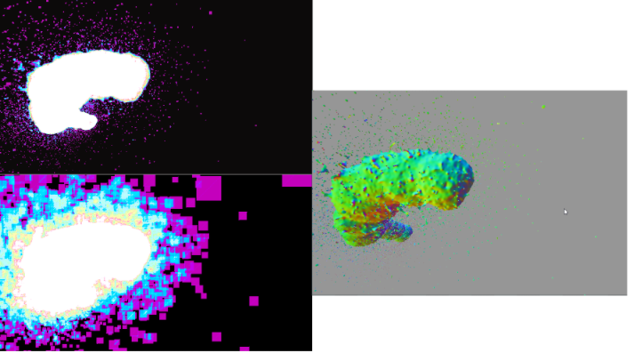

## Rendering, Part 4: Thickness?

The other major problem with the original screen-space particle rendering technique is that it does not capture thickness at all. Techniques involving meshes can simply render the back faces to a separate texture to capture thickness, but with screen-space particle rendering, there is no concept of front or back faces, and it is not really clear how to capture thickness at all.

In my renderer, I eventually landed on a pretty simple technique where we similarly splat a simple circular pattern for each particle, but instead of using the depth buffer, we use additive blending to accumulate the thickness. This is done at a pretty arbitrary threshold, but then the next step is to downscale the resulting thickness map to a lower resolution and apply a downsampling blur to it, which gives a really smooth and nice-looking thickness map. It is not based on any physical properties of the fluid, but it is a good enough approximation for many cases, and it is very cheap to compute as well. It is loosely modeled around Beer-Lambert's law, where the thickness is used to determine how much light is absorbed as it passes through the fluid, which gives a nice sense of depth and volume to the fluid.

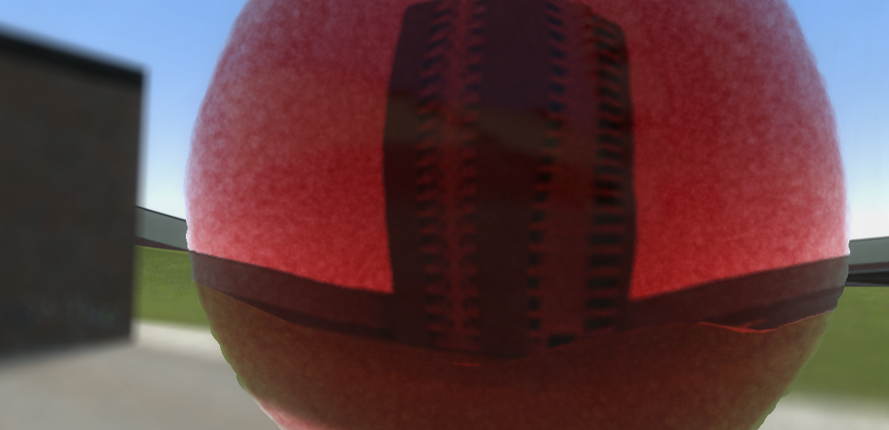

This particular screenshot didn't have downsampling yet but it still captures what it looks like. Additionally, I drove single-event screen space refraction using an additional IoR parameter for different fluids, which adds a nice refractive effect to the fluid as well. The combination of the two gives a really nice sense of depth and volume to the fluid.

I went through many other thickness models, and I tried using the actual distance from the entrance and exit points of the fluid, which is more physically accurate, but it was also much more expensive to compute, and it did not look significantly better than the simple splatting technique.

It was also quite simple to extend the filter, thickness and other features by using a universal particle radius constant to scale everything properly, which is more or less a benefit of screen-space particle rendering as it can handle arbitrary particle sizes without any issues as seen below:

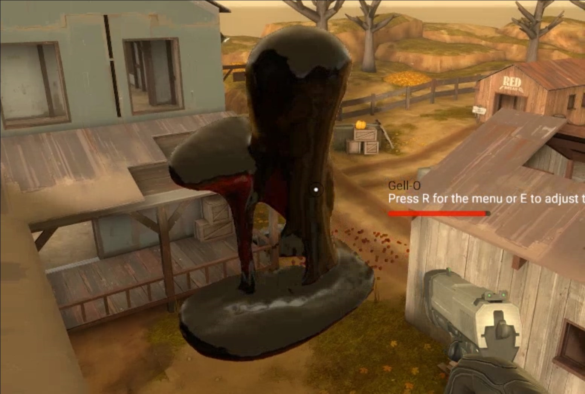

## Rendering, Part 5: Finally, My Own Filter

At this point, we've gone through many iterations of the renderer, and it was honestly okay. But I had a lot of qualms with how, it still did not preserve high-frequency detail. The filter, while it did a good job at preserving wave crests and other large features, it still blurred out a lot of the smaller details, which made the fluid look a bit too smooth and not as realistic as I wanted it to be. Additionally, the filter was quite expensive, especially at higher resolutions, and it was a major bottleneck for performance.

So, it was time to finally build my own filter from what I learned from the previous ones. I wanted to build a filter that was more edge-aware and could preserve more high-frequency detail, while also being cheaper to compute. This is the novel part of my renderer, and it is something that I am quite proud of. It is a bit of a hack, but it works surprisingly well and it is very cheap to compute as well.

My main idea was, instead of having to deal with a rigid 3x3 box filter as many filters do, what if we could have a flexible kernel which dynamically adjusts its shape and size based on the local features of the fluid surface? This way, we can have a much more edge-aware filter that can preserve more high-frequency detail.

I read this article on [Interleaved Gradient Noise](https://blog.demofox.org/2022/01/01/interleaved-gradient-noise-a-different-kind-of-low-discrepancy-sequence/), which is correlated noise for each frame that was originally meant to improve TAA and other temporal effects, but I realized that it could also be used as a way to dynamically adjust the shape and size of the filter kernel.

I changed the frame correlation to instead be related to the current iteration of the filter. That way, the resulting noisy pattern of perturbing the filter points according to the interleaved gradient noise would complete the last pattern created by the last iteration. The more iterations there are, the more complete the pattern becomes, and it creates a really nice edge-aware filter that can preserve a lot of high-frequency detail. It is also very cheap to compute, as it is just a simple noise function that can be computed in the shader.

Additionally, instead of filtering depth, I filter the normals themselves. Now, I know this sounds weird, but in practice it works really well. The normals are much more important for the final shading of the fluid, and they are also much more forgiving to filter than depth. By filtering the normals directly, we can also normalize them after each iteration which helps restore the correct magnitudes.

Finally, the weighting of the filter is determined by the range of the depth discontinuity compared to the depth of the center pixel. This allows the filter to be edge-aware and preserve sharp features. Also, pure discontinuities are discarded, so there is no border from the empty space to the fluid, which is a common issue with many filters.

To illustrate how it works, I will walk through one entire frame of the new filter:

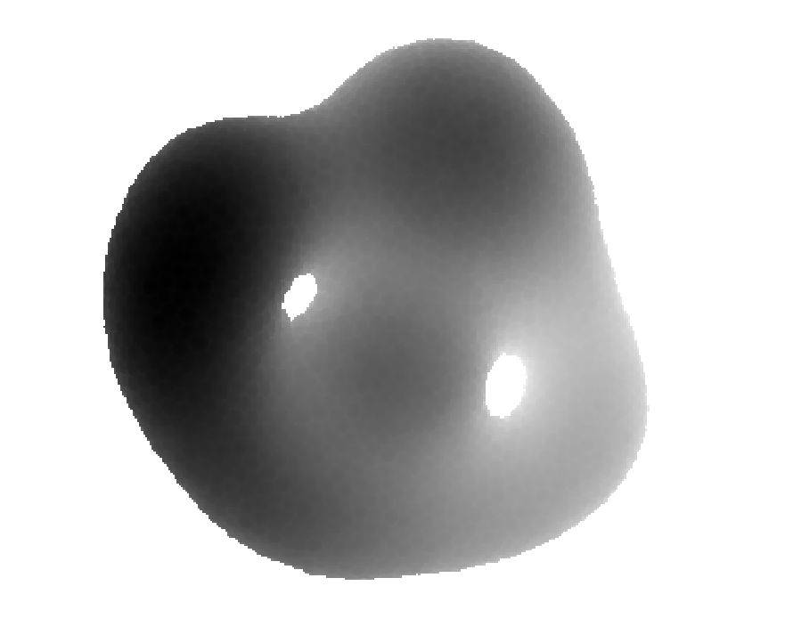

This is the initial depth buffer after rendering the ellipsoids. Nothing special, but we use this as the basis for the normal estimation stage, which computes the gradient over the depth map and outputs the following:

The normals are now estimated and the new filter will operate on a ping-pong pair of normal maps, where one is the input and the other is the output. Additionally, I added a trick to expand our kernel footprint exponentially if needed by computing new mipchains each odd iteration, which allows us to capture a much wider range of discontinuities without having to increase the kernel size and thus the number of samples. The filter then iteratively blurs the normal map according to the interleaved gradient noise pattern, which creates a really nice edge-aware filter that can preserve a lot of high-frequency detail. The first iteration contains the pattern:

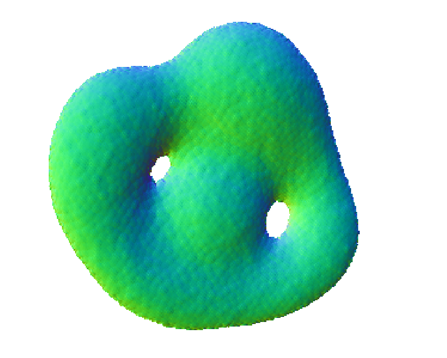

Something that might immediately jump out is that the filter does not necessarily blur, but rather "melt" the edges of the ellipsoids together, which creates a much more natural look to the fluid surface. There is also a noticeable stippling effect, which is a result of the noise pattern, but it actually helps with the overall look of the fluid as it creates a lot of high-frequency detail that would otherwise be lost with a regular blur.

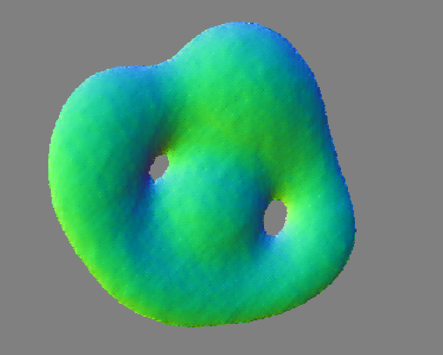

The second iteration continues to melt the edges together, and the stippling effect becomes less pronounced as the normal map becomes smoother.

For brevity's sake, I will skip to the last iteration:

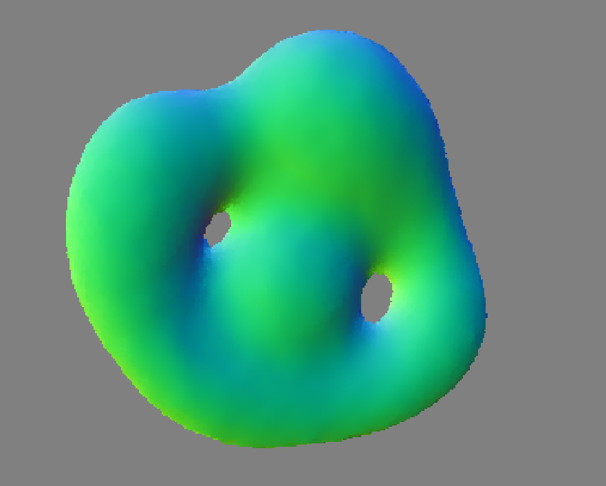

As you can see, the resulting normal map is very smooth and has a lot of high-frequency detail, while still preserving sharp features like bends or discontinuities. The noise pattern is imperceptible at this point. The most important part is that any changes in the normal line up with the original normal map, which means that we are preserving the original features of the fluid surface. The other filters I tried shift the normals around a lot, which creates a very blurry and unrealistic look to the fluid surface.

This ended up being the final filter that I used for Gelly, and I am quite happy with how it turned out. It definitely improves the final look tenfold, and it is also very cheap to compute, which is a huge bonus since it only requires a constant nine taps per iteration, and it converges very quickly as well. It is a bit of a hack, but it works surprisingly well and it is something that I am quite proud of.

At the end of Gelly's development, I added two more features, whitewater and scattering. Whitewater is a common effect in fluid rendering, and it is essentially just small particles that are emitted from the fluid surface when there is a lot of turbulence. FleX already added something like this, diffuse particles, which mimic spray, but I went further and developed a compute-based solution to compute the derivative of the velocities of the particles, which is a good indicator of turbulence, and then change the most turbulent particles to scatter more light. It ended up being a pretty neat approximation as seen below:

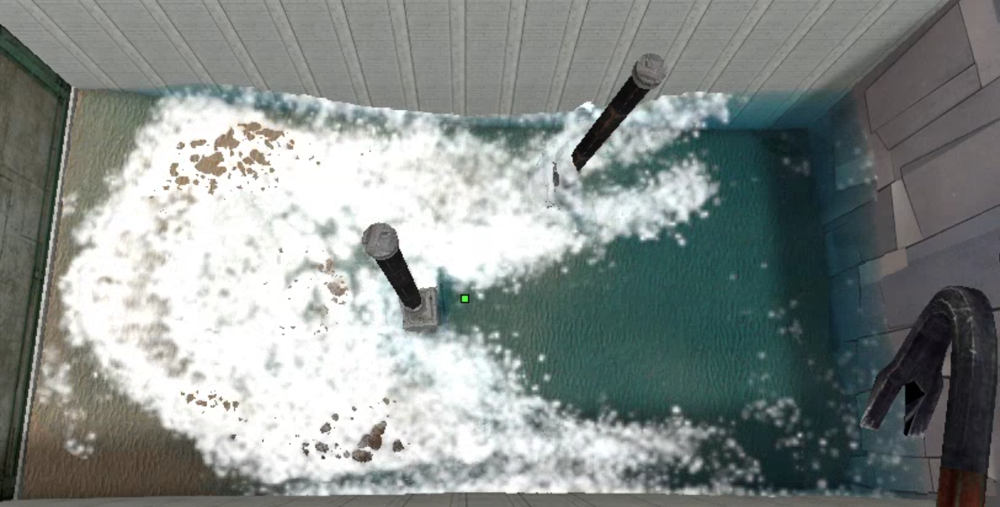

Scattering is another common effect in fluid rendering, and it is essentially just the way light interacts with the fluid surface. I implemented a simple screen-space scattering effect that uses the thickness map to determine how much light is scattered as it passes through the fluid. It is also based primarily off of this article by Colin Barre-Brisebois, [Approximating Translucency for a Fast, Cheap and Convincing Subsurface Scattering Look](https://colinbarrebrisebois.com/2011/03/07/gdc-2011-approximating-translucency-for-a-fast-cheap-and-convincing-subsurface-scattering-look/).

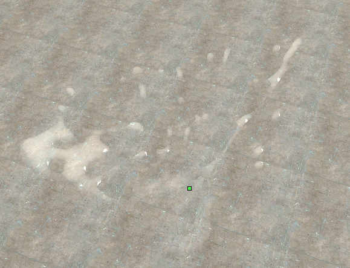

I also combined it with the typical refraction and reflection lobes to give the fluid a much more convincing look. I really like how it turned out and it looks really gooey and thick, which is what I wanted to capture with some of the built-in fluid presets I created.

Here are some final screenshots of the fluid renderer in action:

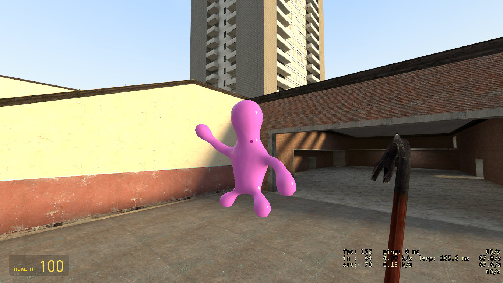

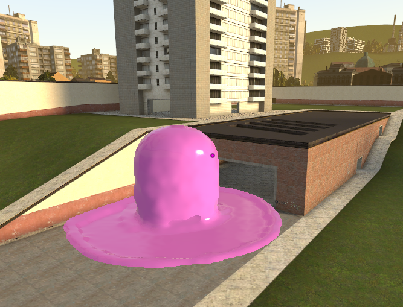

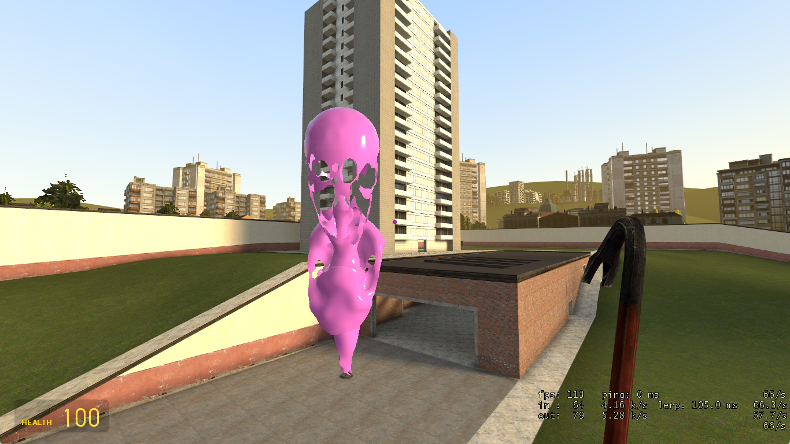

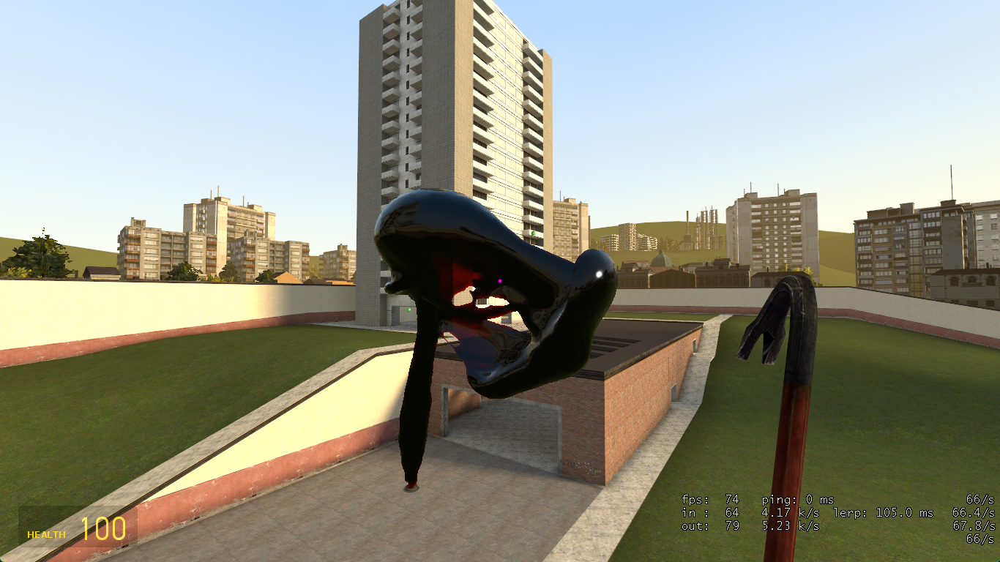

## Conclusion

Overall, Gelly's renderer was a massive undertaking, and it was definitely the most technically challenging part of the project. However, I am quite happy with how it turned out, and I think it is a pretty good example of how to implement a real-time fluid renderer using screen-space particle rendering techniques. The final filter itself is fascinating and I am glad to finally have shared it, as I think it is really nice compared to the previous filters I tried. There was a lot of trial and error involved in finding the right techniques and optimizations to get it to a point where it was both performant and looked good, but I think it was worth it in the end.

It was also a project that attracted many users and contributors, with around 800 users using Gelly at its peak. It also really, *really* emphasized the importance of testing on other hardware. It is surprising how many cross-vendor issues I encountered during development, especially with the D3D9 and D3D11 interop, and it was only through testing on a wide range of hardware that I was able to identify and fix these issues.

Gelly is still available on GitHub, but I have moved on from it and I am not actively maintaining it anymore. You can explore the repository and the aforementioned renderer source code [here](https://github.com/gelly-gmod/gelly).
